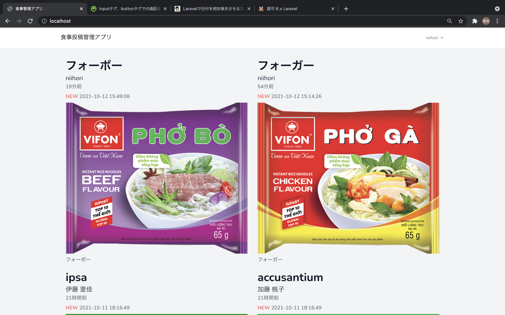
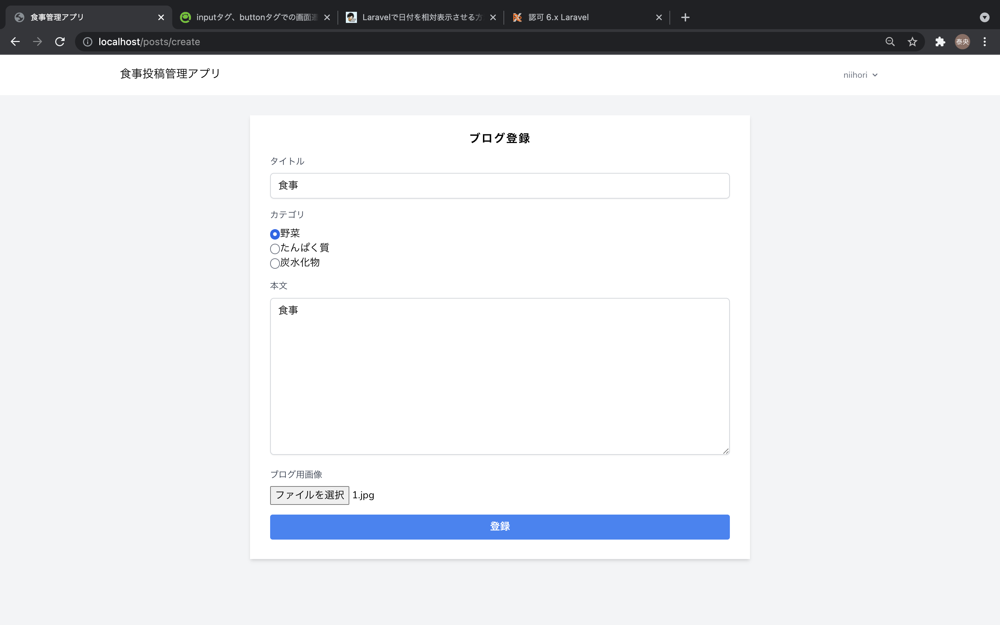
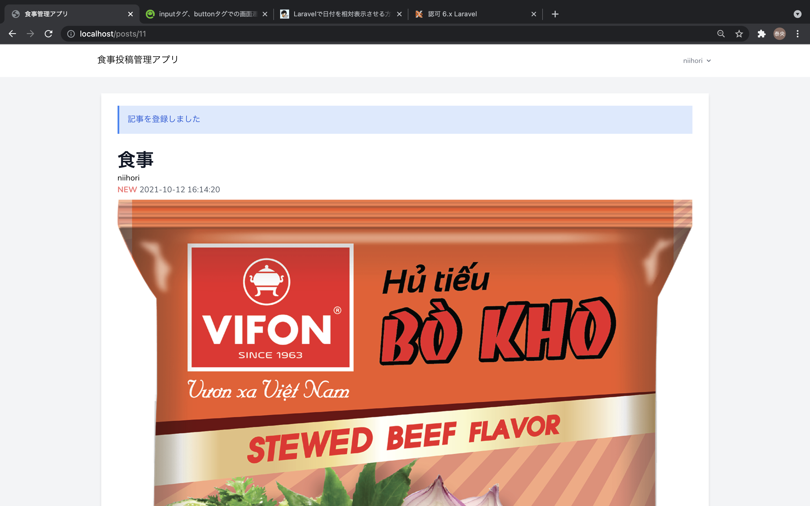
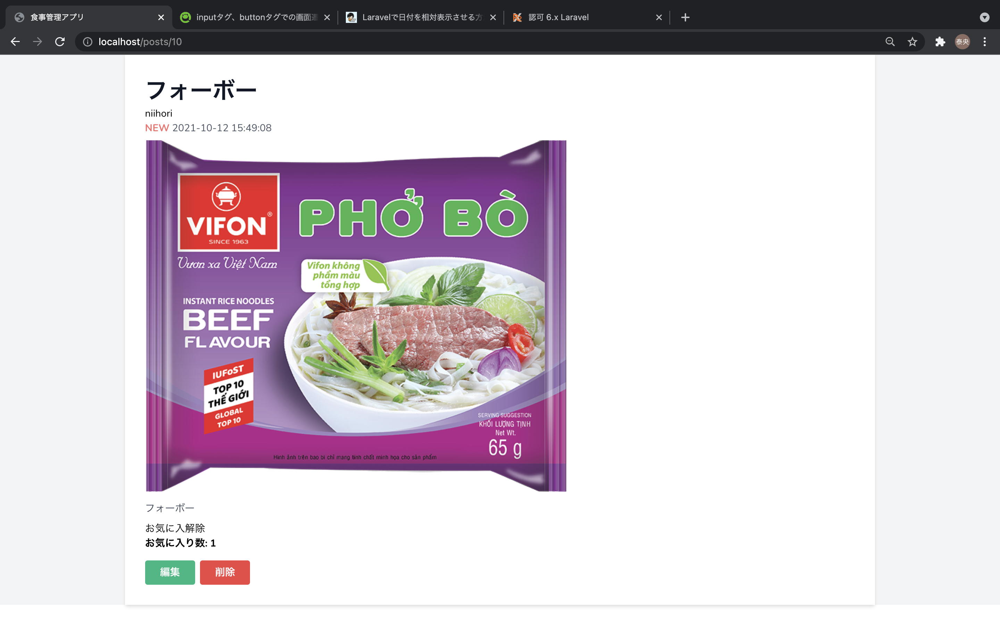
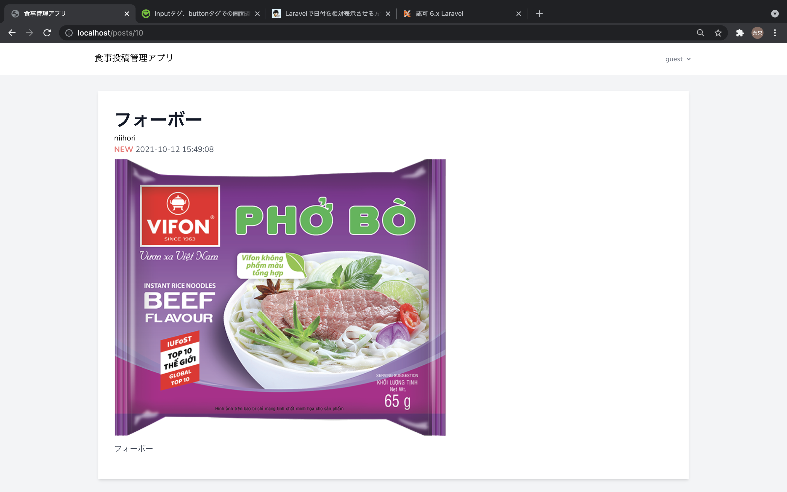
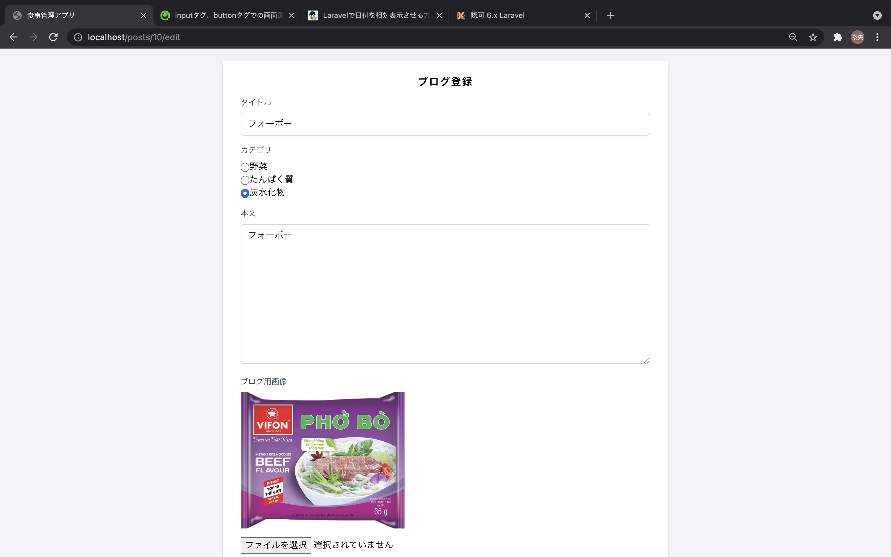

# 食事投稿App

## About this app
---
* 食事を気軽にCRUDできるアプリ
* ログイン時のお気に入り機能を搭載
* 初期データとして、複数のユーザ・画像をファクトリーで登録しています。

## テーブル定義
---
* categoriesテーブル・・・食事の栄養成分情報が含まれるの食事のカテゴリ情報を格納
* postsテーブル・・・各投稿の情報を格納、categoriestableへの外部キーあり
* likesテーブル・・・poststable,Userstableへの外部キーあり

## 実装機能
---

* CRUD
  * 食事がCRUDできるようになっています
  * バリデーションも実装済

* お気に入り
  * ユーザIDに紐付けられ「お気に入り」がカウントできるようになっています。

* ファイルアップロード
   * 商品の画像は、ファイルアップロードできるようにしました

## 画面
---
一覧画面

新規登録画面

詳細画面

*ログイン時

*ログアウト時

編集画面

